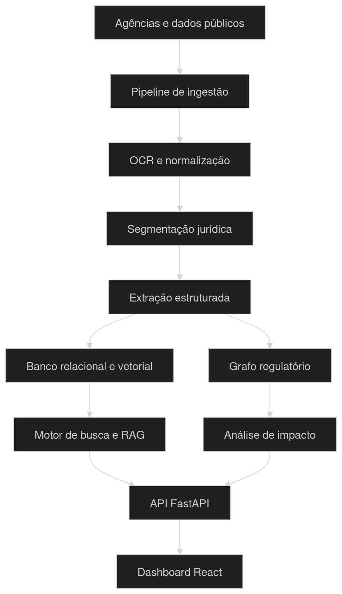
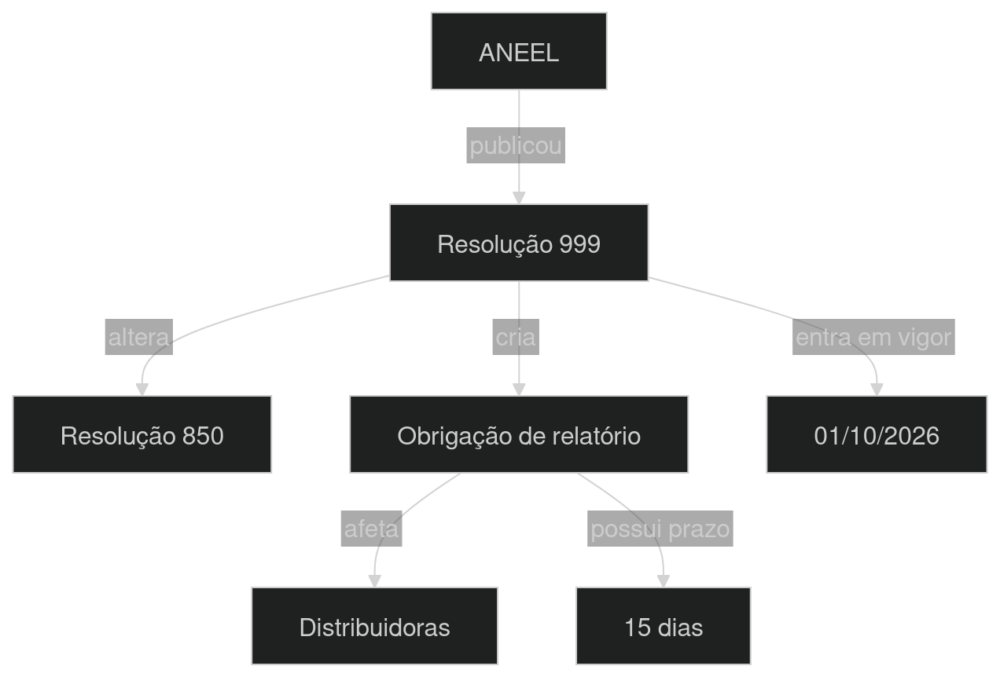

# RegulaGraph AI

Plataforma experimental de inteligência regulatória para ingerir, estruturar,
relacionar e analisar normas brasileiras com rastreabilidade documental.

## O que demonstra

- Upload e extração de PDFs com preservação de páginas.
- Segmentação jurídica por artigos e parágrafos.
- Comparação de versões e classificação de mudanças.
- Extração estruturada de obrigações, prazos e entidades.
- Consultas temporais que respeitam vigência e revogação.
- Busca híbrida (texto + vetor) preparada para pgvector.
- Grafo regulatório no Neo4j.
- Respostas com evidência, página, confiança e revisão humana.
- Dataset de avaliação e métricas de precisão, recall e citações.
- FastAPI, React/TypeScript, Celery, Redis, PostgreSQL e Docker.

## Início rápido

```bash
cp .env.example .env
docker compose up --build
```

- Aplicação: http://localhost:5173
- API/Swagger: http://localhost:8000/docs
- Neo4j Browser: http://localhost:7474

O padrão `LLM_PROVIDER=heuristic` funciona sem chave externa. Configure
`LLM_PROVIDER=openai` e `OPENAI_API_KEY` para extração por modelo.

## Arquitetura



### Exemplo real de funcionamento

Ao inserir uma nova resolução da ANEEL, o sistema responde:

- Quais artigos foram modificados ou revogados;
- Quais normas anteriores foram citadas;
- Quais obrigações foram criadas;
- Quais empresas ou agentes regulados foram afetados;
- Quais prazos começaram ou terminaram;
- Quais conceitos jurídicos mudaram;
- Possíveis conflitos com outras normas;
- Linha do tempo da evolução regulatória;
- Evidências e páginas que sustentam cada conclusão;
- Grau de confiança da IA;
- Pontos que precisam de revisão humana.

## Grafo regulatório



Essa é a parte mais diferenciada: cada norma, artigo, órgão, entidade e
obrigação é representado como um nó, e as relações entre eles (alteração,
revogação, regulamentação, citação) formam arestas no Neo4j. Isso permite
navegar o impacto regulatório de forma transitiva — por exemplo, descobrir
todas as normas afetadas por uma única revogação.

## Fluxo principal

1. Envie uma norma em PDF ou texto.
2. O worker extrai páginas e dispositivos jurídicos.
3. Obrigações e relações são validadas com Pydantic.
4. Compare duas normas para gerar um relatório de impacto.
5. Faça uma pergunta indicando a data de referência.
6. Confira cada resposta na evidência original.

## Qualidade

```bash
make test
```

O endpoint `/api/v1/evaluations/run` executa o conjunto de referência presente
em `backend/evaluation/golden.jsonl`. Amplie esse arquivo com anotações reais.

## Limites intencionais do MVP

- OCR está preparado como extensão, mas a imagem Tesseract não vem ativada.
- Embeddings e busca híbrida têm interface própria; o modo local usa busca lexical.
- Resultados de IA são apoio à análise e exigem revisão humana.
- Use apenas documentos públicos e confira termos de uso dos portais de origem.
